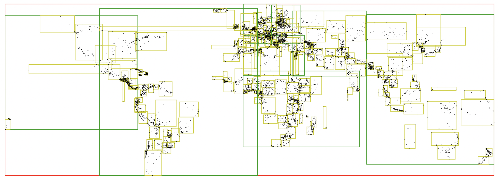

# rtree.rs

[](LICENSE)
[](https://crates.io/crates/rtree_rs)
[](https://crates.io/crates/rtree_rs/)
[](https://docs.rs/rtree_rs/)

A fast [R-tree](https://en.wikipedia.org/wiki/R-tree) for Rust. Ported from [an implementation](https://github.com/tidwall/rtree) that's designed for [Tile38](https://github.com/tidwall/tile38).



## Features

- [Optimized](#algorithms) for fast inserts and updates. Ideal for both static and moving data.
- Standard `insert`, `remove`, and `search` operations
- Includes `nearby` function for performing nearest neighbors (kNN) iterations
- Supports integers or floats for coordinates. `f32`, `f64`, `u64`, etc.
- Allows for multiple dimensions using const generics.

## Examples

### Add points

```rust
use rtree_rs::{RTree, Rect};

let mut tr = RTree::new();

// Insert some points
tr.insert(Rect::new_point([-112.0078, 33.4373]), "PHX");
tr.insert(Rect::new_point([-118.4071, 33.9425]), "LAX");
tr.insert(Rect::new_point([-73.7822, 40.6441]),  "JFK");

// Search a rectangle
for item in tr.search(Rect::new([-112.1, 33.4], [-112.0, 33.5])) {
    println!("{}", item.data);
}

// OUTPUT:
// PHX
```

### Add retangles

```rust
tr.insert(Rect::new([10, 10], [20, 20]), "R1");
tr.insert(Rect::new([15, 12], [18, 24]), "R2");
```

### Multiple dimensions

```rust
tr.insert(Rect::new([10, 10, 10], [20, 20, 20]), "R1");
tr.insert(Rect::new_point([15, 12, 24]), "P1");
```


## Algorithms

This implementation is a variant of the original paper:  
[R-TREES. A DYNAMIC INDEX STRUCTURE FOR SPATIAL SEARCHING](http://www-db.deis.unibo.it/courses/SI-LS/papers/Gut84.pdf)

### Inserting

From the root to the leaf, the rectangles which will incur the least enlargement are chosen. Ties go to rectangles with the smallest area.

When a rectangle does not incur any enlargement at all, it's chosen immediately and without further checks of other rectangles in the same node.

### Splitting

This implementation attempts to minimize intensive operations such as pre-sorting the children and comparing overlaps & area sizes. The desire is to do simple single axis distance calculation on each child only once, with a target 50/50 chance that the child might be moved in-memory.

When a rect has reached it's max number of entries it's largest axis is calculated and the rect is split into two smaller rects, named `left` and `right`. Each child rects is then evaluated to determine which smaller rect it should be placed into. Two values, `min-dist` and `max-dist`, are calcuated for each child. 

- `min-dist` is the distance from the parent's minumum value of it's largest axis to the child's minumum value of the parent largest axis.
- `max-dist` is the distance from the parent's maximum value of it's largest axis to the child's maximum value of the parent largest axis.

When the `min-dist` is less than `max-dist` then the child is placed into the `left` rect, otherwise the child is placed into the `right` rect. 

If either left or right has fewer than the minimum allowable entries, then it will take enough entries from the other rectangle to ensure that the minumum is reached. The chosen ones are based on the distance of the farthest edge to the other rectangle's axis.

Finally, the child rectangles are sorted in their parent node by the minimum x value.

### Deleting

Similar to the original algorithm.
A target rect is deleted directly. When the number of children in a rectangle falls below the minumum allowed, that child is removed from the tree and all of it's leaf items are re-inserted into the tree starting at the root.

### Searching

Same as the original algorithm.


## Performance 

On my 2021 Macbook M1 Max.

```
cd bench
cargo run --release
```

```
insert:        1,000,000 ops in 347ms, 2,880,185/sec, 347 ns/op
search-item:   1,000,000 ops in 370ms, 2,700,423/sec, 370 ns/op
search-1%:     10,000 ops in 31ms, 321,916/sec, 3106 ns/op
search-5%:     10,000 ops in 233ms, 42,739/sec, 23397 ns/op
search-10%:    10,000 ops in 704ms, 14,195/sec, 70442 ns/op
remove-half:   500,000 ops in 170ms, 2,937,350/sec, 340 ns/op
reinsert-half: 500,000 ops in 169ms, 2,945,730/sec, 339 ns/op
search-item:   1,000,000 ops in 434ms, 2,304,059/sec, 434 ns/op
search-1%:     10,000 ops in 34ms, 287,740/sec, 3475 ns/op
remove-all:    1,000,000 ops in 363ms, 2,751,735/sec, 363 ns/op
```
